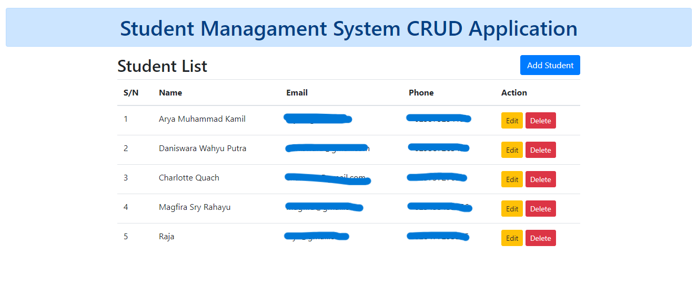

# Flask CRUD Application

This is a simple Flask application that demonstrates basic CRUD (Create, Read, Update, Delete) operations using a MySQL database. It allows you to manage student records.

## Preview



## Prerequisites

Before running this application, make sure you have the following installed:

- Python (version 3.6 or higher)
- MySQL (you can use XAMPP, WAMP, or any other MySQL server)

## Setup

1. Clone this repository to your local machine:

   ```bash
   git clone https://github.com/Halip26/student-list-crud.git
   ```

2. Navigate to the project directory:

   ```bash
   cd flask-crud-app
   ```

3. Install the required Python packages (Flask and Flask-MySQLdb):

   ```bash
   pip install flask flask-mysqldb
   ```

4. Configure your MySQL database:
   - Create a new database (e.g., `crud_flask`).
   - Update the `app.config` section in `app.py` with your MySQL credentials (host, user, password, and database name).

5. Run the application:

   ```bash
   python app.py
   ```

6. Open your web browser and go to [http://localhost:5000/](http://localhost:5000/) to access the application.

## Usage

- The home page (`/`) displays a list of all students.
- You can add a new student by clicking the "Add Student" button.
- To update a student's information, click the "Edit" button next to their name.
- To delete a student, click the "Delete" button next to their name.

## Contributing

Feel free to contribute to this project by opening issues or submitting pull requests. Your feedback and improvements are welcome!

## License

This project is licensed under the MIT License - see the [LICENSE](LICENSE) file for details.

---
